# F51 - Skin Tone Preset Library

## Overview

The Skin Tone Preset Library provides a curated and community-driven collection of photo editing presets optimized for melanin-rich skin tones. Each preset stores a comprehensive set of Lightroom-compatible adjustment values -- basic tone adjustments (Temperature, Tint, Exposure, Contrast, Highlights, Shadows, Whites, Blacks, Clarity, Vibrance, Saturation), HSL channel adjustments (Hue, Saturation, and Luminance for each of 8 color channels: Red, Orange, Yellow, Green, Aqua, Blue, Purple, Magenta), and split-tone color grading values (HighlightHue, HighlightSaturation, ShadowHue, ShadowSaturation). These values are stored in a structured format that can be exported as Lightroom XMP-compatible data.

Presets are categorized along two axes: skin tone range (Light, Medium, Deep, VeryDeep) and shooting context (StudioPortrait, OutdoorNatural, EventReception, GoldenHour, LowLight, Flash). Photographers browse presets using these filters, with results ordered by popularity (favorite count). Any authenticated photographer can favorite or unfavorite presets for quick access. The full preset detail endpoint returns all adjustment values in a Lightroom-compatible structure.

Photographers and platform admins can create new presets. Photographers may update or soft-delete only their own presets -- attempts to modify another photographer's preset return 403. When a preset is soft-deleted, other photographers' favorites referencing it display an "unavailable" indicator. The platform ships with at least 8 curated system presets (isSystemPreset=true, author="Anansi") spanning all four skin tone ranges and multiple shooting contexts. System presets cannot be edited or deleted by photographers.

**L2 Requirements:** PRE-23.1.1 (Create Preset), PRE-23.2.1 (Browse by Category), PRE-23.2.2 (Favorite), PRE-23.2.3 (Preset Detail), PRE-23.3.1 (Update Own), PRE-23.3.2 (Delete Own), PRE-23.3.3 (Seed System Presets)

---

## Components

### Domain Layer

| Component | Type | Description |
|-----------|------|-------------|
| `EditingPreset` | Entity | Core preset entity. Fields: `Name`, `Description`, `AuthorId` (Guid?, null for system), `AuthorName` (string, "Anansi" for system), `IsSystemPreset` (bool), `SkinToneRange` (enum), `ShootingContext` (enum), `FavoriteCount` (int), `IsPublic` (bool, default true). Extends `BaseEntity`, implements `ISoftDeletable`, `IAuditableEntity`. |
| `PresetAdjustments` | Owned Entity | Owned by `EditingPreset`. Stores all Lightroom-compatible values: `Temperature` (double), `Tint` (double), `Exposure` (double), `Contrast` (double), `Highlights` (double), `Shadows` (double), `Whites` (double), `Blacks` (double), `Clarity` (double), `Vibrance` (double), `Saturation` (double). |
| `PresetHslChannel` | Entity | One record per color channel per preset. Fields: `PresetId`, `Channel` (HslColorChannel enum), `Hue` (double), `Saturation` (double), `Luminance` (double). 8 channels: Red, Orange, Yellow, Green, Aqua, Blue, Purple, Magenta. |
| `PresetSplitTone` | Owned Entity | Owned by `EditingPreset`. Fields: `HighlightHue` (double), `HighlightSaturation` (double), `ShadowHue` (double), `ShadowSaturation` (double). |
| `PresetFavorite` | Entity | Join entity: `PhotographerId`, `PresetId`, `CreatedAt`. Unique constraint on `(PhotographerId, PresetId)`. |
| `SkinToneRange` | Enum | `Light`, `Medium`, `Deep`, `VeryDeep`. |
| `ShootingContext` | Enum | `StudioPortrait`, `OutdoorNatural`, `EventReception`, `GoldenHour`, `LowLight`, `Flash`. |
| `HslColorChannel` | Enum | `Red`, `Orange`, `Yellow`, `Green`, `Aqua`, `Blue`, `Purple`, `Magenta`. |
| `PresetFavoritedEvent` | Domain Event | Raised when a preset is favorited. Increments `FavoriteCount`. |
| `PresetUnfavoritedEvent` | Domain Event | Raised when a preset is unfavorited. Decrements `FavoriteCount`. |

### Application Layer

| Component | Type | Description |
|-----------|------|-------------|
| `CreatePresetCommand` | Command | Creates a new preset. Accepts name, description, skin tone range, shooting context, isPublic, and the full set of adjustment values (basic, HSL array, split tone). Sets `AuthorId` to current user. Returns `PresetDetailDto`. |
| `UpdatePresetCommand` | Command | Updates an existing preset. Validates that the current user is the author (403 otherwise). System presets cannot be updated (403). Accepts all mutable fields and adjustment values. |
| `DeletePresetCommand` | Command | Soft-deletes a preset. Validates ownership (403 for non-owner). System presets cannot be deleted (403). Sets `IsDeleted=true`, `DeletedAt=now`. |
| `FavoritePresetCommand` | Command | Adds a `PresetFavorite` for the current user. Raises `PresetFavoritedEvent`. Idempotent -- if already favorited, returns success without duplicating. |
| `UnfavoritePresetCommand` | Command | Removes the `PresetFavorite` for the current user. Raises `PresetUnfavoritedEvent`. Idempotent. |
| `BrowsePresetsQuery` | Query | Paginated query with optional filters: `SkinToneRange?`, `ShootingContext?`, `IsSystem?`, `SearchTerm?`. Results ordered by `FavoriteCount` descending. Each result includes whether the current user has favorited it. |
| `GetPresetDetailQuery` | Query | Returns full preset including all adjustment values (basic, 8 HSL channels, split tone) for a given preset ID. Returns 404 if soft-deleted. |
| `GetFavoritePresetsQuery` | Query | Returns the current user's favorited presets. Includes an `IsAvailable` flag (false if the preset has been soft-deleted). |
| `PresetSummaryDto` | DTO | Browse result: `Id`, `Name`, `Description`, `AuthorName`, `SkinToneRange`, `ShootingContext`, `FavoriteCount`, `IsSystemPreset`, `IsFavorited` (by current user), `IsAvailable`. |
| `PresetDetailDto` | DTO | Full detail: all fields from `PresetSummaryDto` plus `Temperature`, `Tint`, `Exposure`, `Contrast`, `Highlights`, `Shadows`, `Whites`, `Blacks`, `Clarity`, `Vibrance`, `Saturation`, `HslChannels[]` (channel, hue, sat, lum), `SplitTone` (highlightHue, highlightSat, shadowHue, shadowSat). |
| `CreatePresetCommandValidator` | Validator | Name required (max 100 chars). SkinToneRange and ShootingContext must be valid enum values. HSL array must have exactly 8 entries with valid channel values. All numeric adjustments within Lightroom-valid ranges. |

### Infrastructure Layer

| Component | Type | Description |
|-----------|------|-------------|
| `CreatePresetCommandHandler` | Handler | Creates `EditingPreset` with owned `PresetAdjustments` and `PresetSplitTone`, plus 8 `PresetHslChannel` records. Persists via `IApplicationDbContext`. |
| `UpdatePresetCommandHandler` | Handler | Loads preset, validates ownership, updates all fields and child entities. |
| `DeletePresetCommandHandler` | Handler | Loads preset, validates ownership and non-system, sets soft-delete fields. |
| `FavoritePresetCommandHandler` | Handler | Creates `PresetFavorite` if not exists. Increments `EditingPreset.FavoriteCount`. |
| `UnfavoritePresetCommandHandler` | Handler | Removes `PresetFavorite` if exists. Decrements `EditingPreset.FavoriteCount`. |
| `BrowsePresetsQueryHandler` | Handler | Builds a query with optional filters against `EditingPreset` where `IsDeleted=false`. Left-joins `PresetFavorite` for the current user to set `IsFavorited`. Orders by `FavoriteCount DESC`. Paginates. |
| `GetPresetDetailQueryHandler` | Handler | Loads `EditingPreset` with eager-loaded `PresetAdjustments`, `PresetHslChannel` (8 records), and `PresetSplitTone`. Maps to `PresetDetailDto`. |
| `PresetSeedService` | Service | Runs on application startup. Seeds 8+ system presets if they do not already exist. Presets span all `SkinToneRange` values and multiple `ShootingContext` values. Each has `IsSystemPreset=true`, `AuthorName="Anansi"`, `AuthorId=null`. |
| `EditingPresetConfiguration` | EF Config | Index on `(SkinToneRange, ShootingContext)` for filtered browsing. Index on `FavoriteCount DESC` for popularity ordering. Owns `PresetAdjustments` and `PresetSplitTone` as table-splitting. |
| `PresetHslChannelConfiguration` | EF Config | Composite key on `(PresetId, Channel)`. Foreign key to `EditingPreset`. |
| `PresetFavoriteConfiguration` | EF Config | Unique constraint on `(PhotographerId, PresetId)`. Index on `PhotographerId` for favorites list query. |

### API Layer

| Component | Type | Description |
|-----------|------|-------------|
| `PresetsController` | Controller | CRUD and browse endpoints. `POST /api/presets` (create, `[Authorize]`). `GET /api/presets` (browse with query filters, `[Authorize]`). `GET /api/presets/{id}` (detail, `[Authorize]`). `PUT /api/presets/{id}` (update, `[Authorize]`). `DELETE /api/presets/{id}` (soft-delete, `[Authorize]`). |
| `PresetFavoritesController` | Controller | Favorite management. `POST /api/presets/{id}/favorite` (`[Authorize]`). `DELETE /api/presets/{id}/favorite` (`[Authorize]`). `GET /api/presets/favorites` (list user's favorites, `[Authorize]`). |

---

## Class Diagrams

### Domain Layer -- Preset Core Entity & Enums

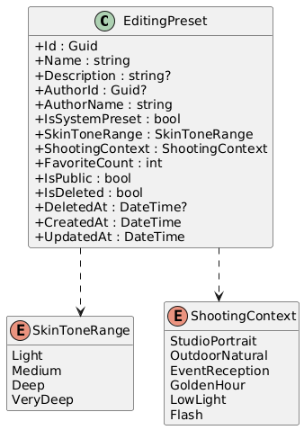

### Domain Layer -- Adjustment Values & HSL Channels

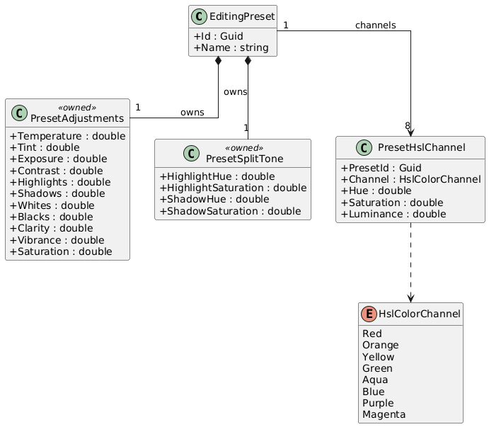

### Domain Layer -- Favorites

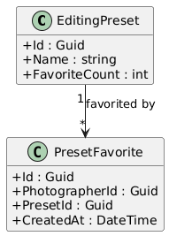

### Application Layer -- Commands & Queries

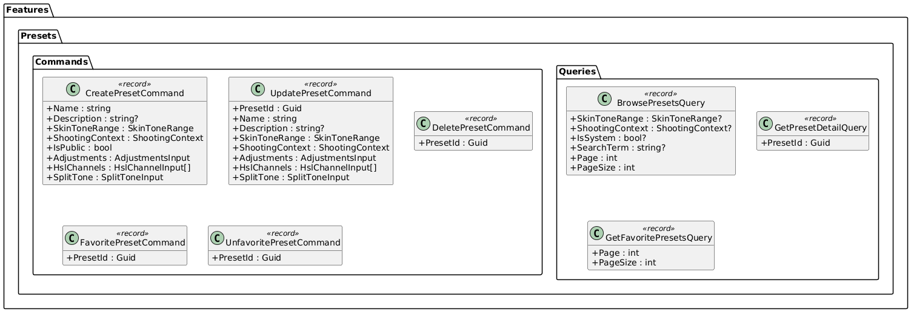

### Application Layer -- DTOs

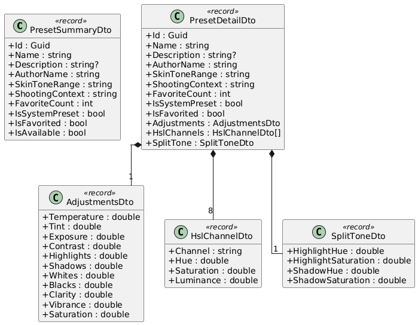

### API Layer -- Preset Controllers

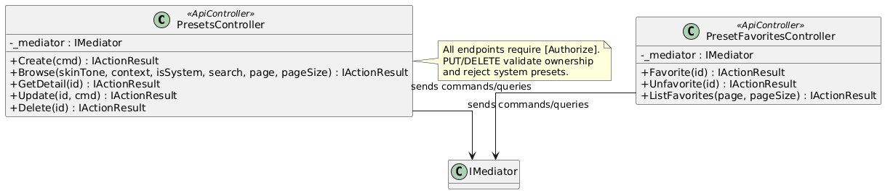

---

## Sequence Diagrams

### Create a New Preset

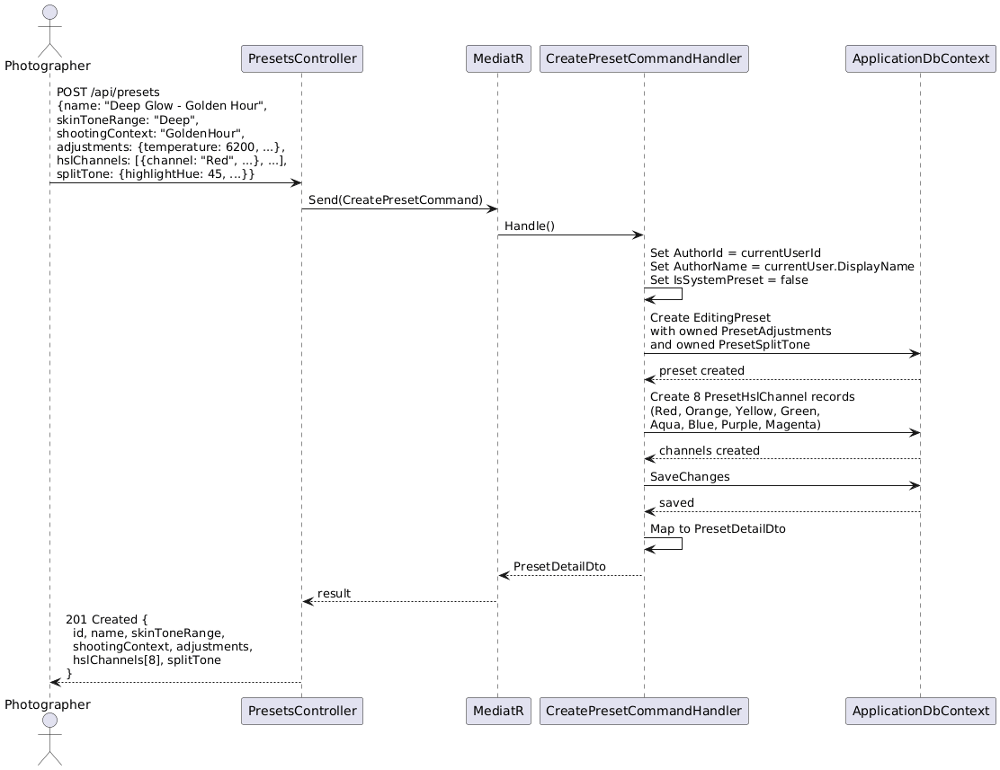

### Browse Presets with Filters

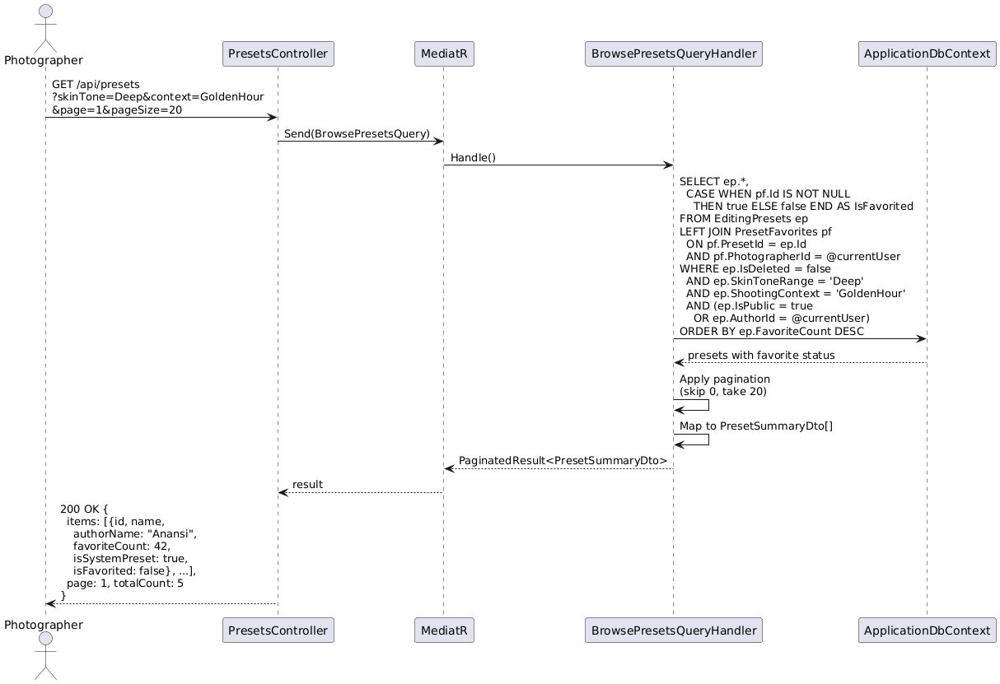

### Favorite / Unfavorite a Preset

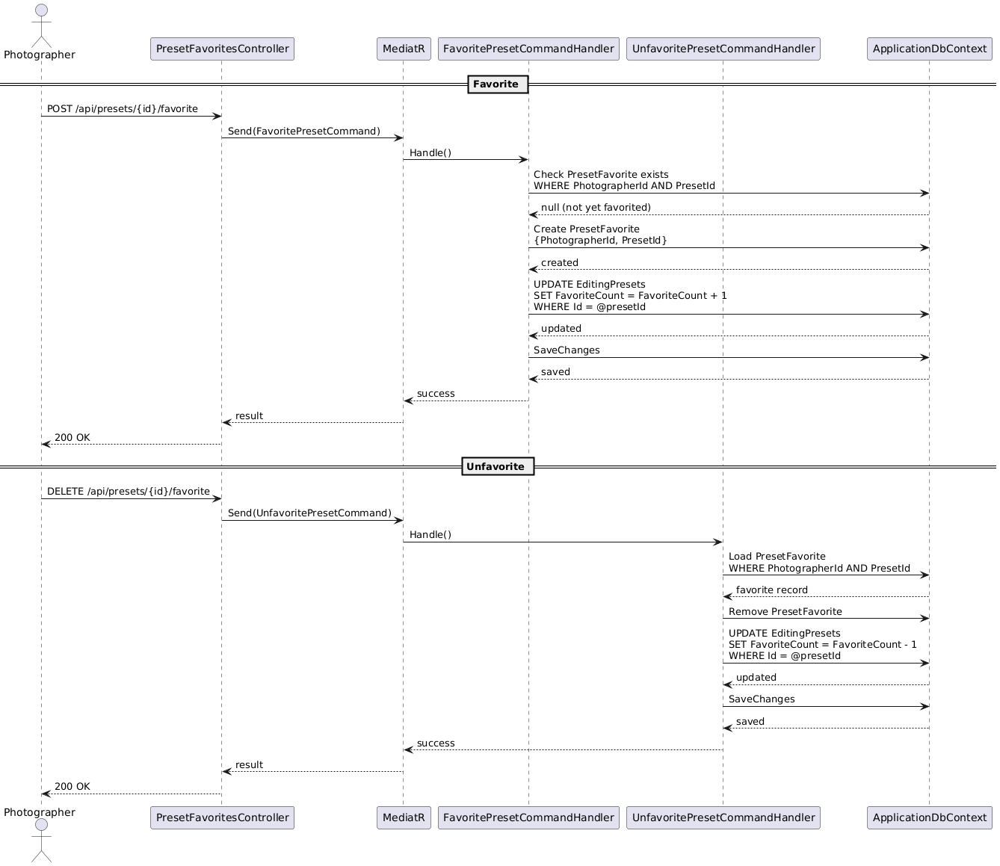

### Get Full Preset Detail

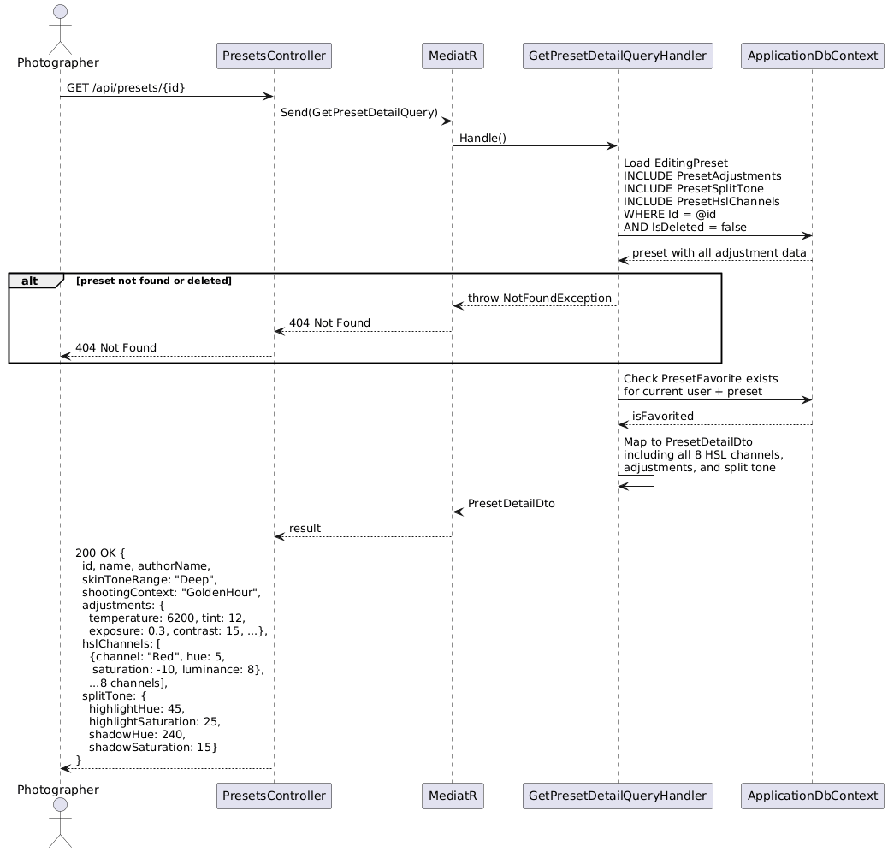

### Update Own Preset (with Ownership Check)

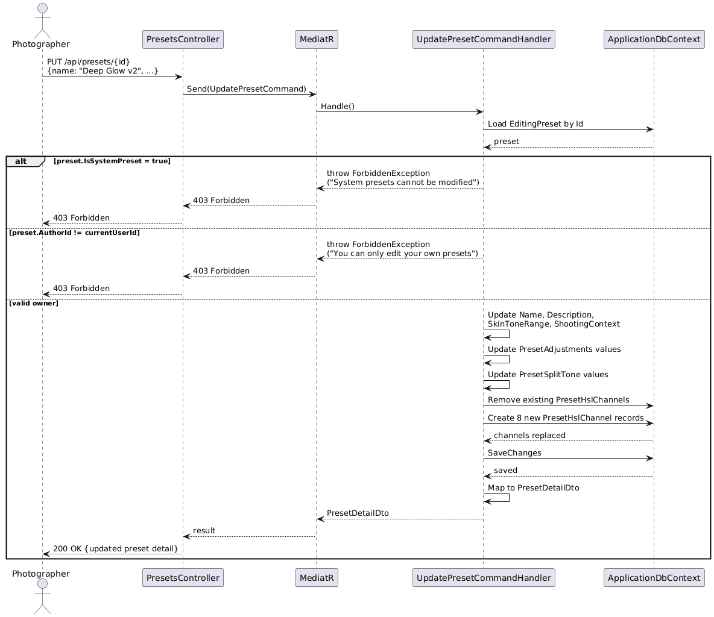

### Soft-Delete Own Preset

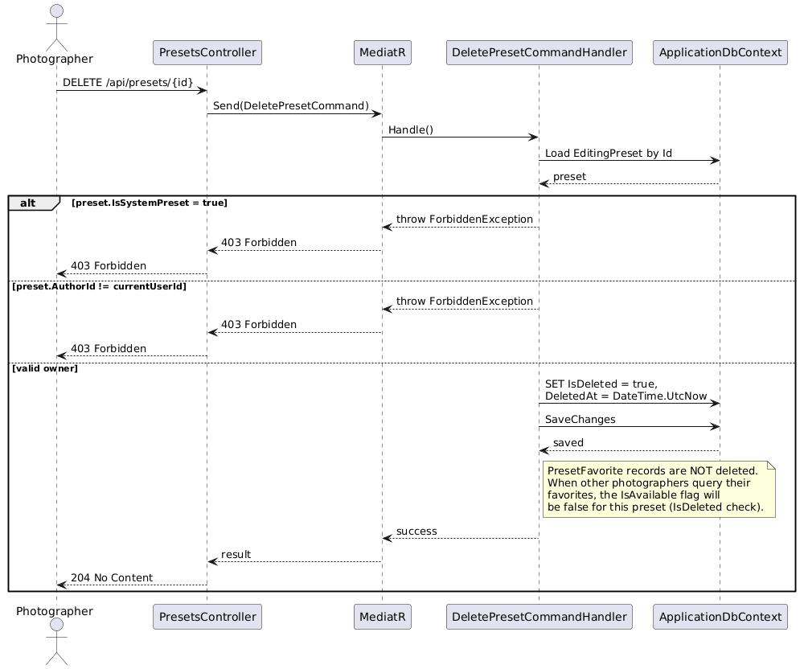
