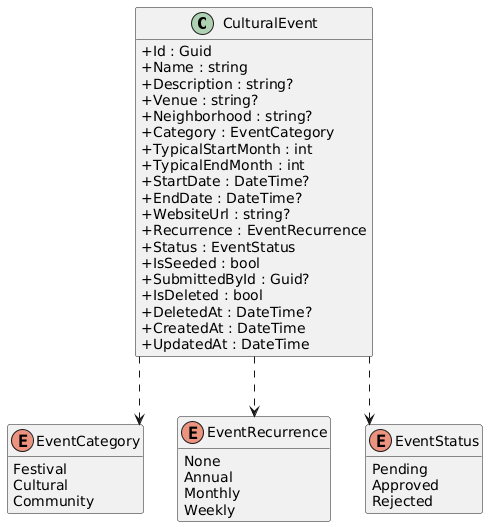
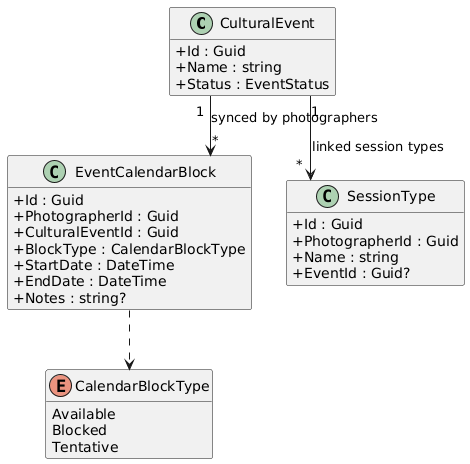
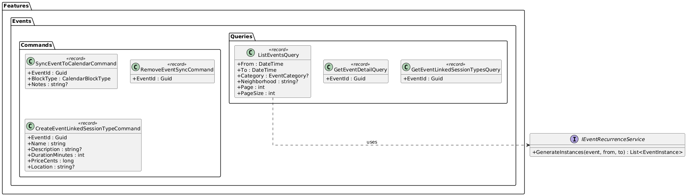
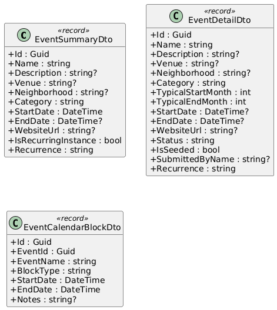
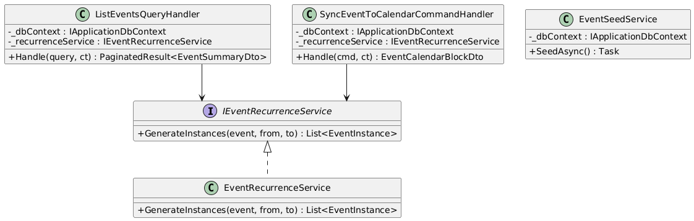
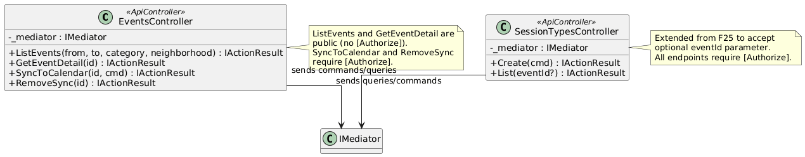
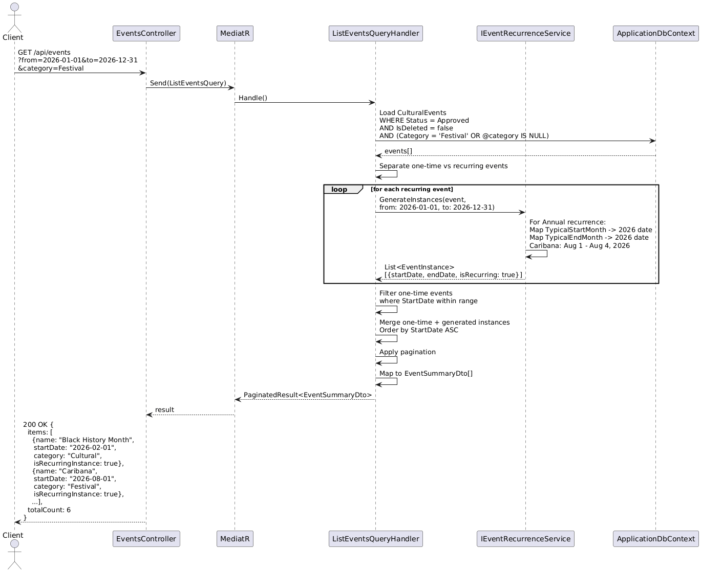
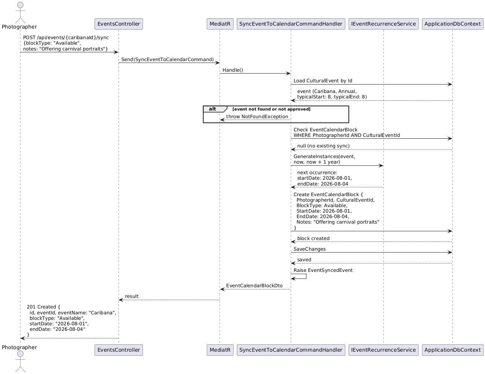
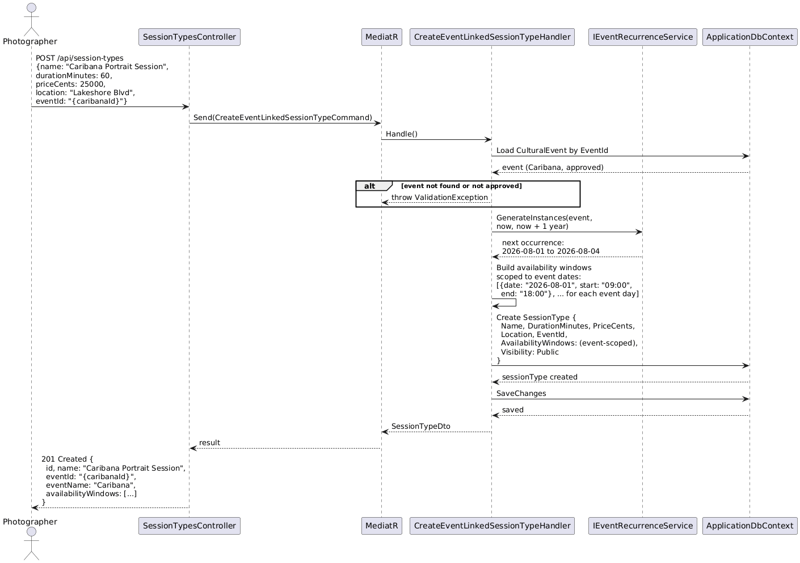
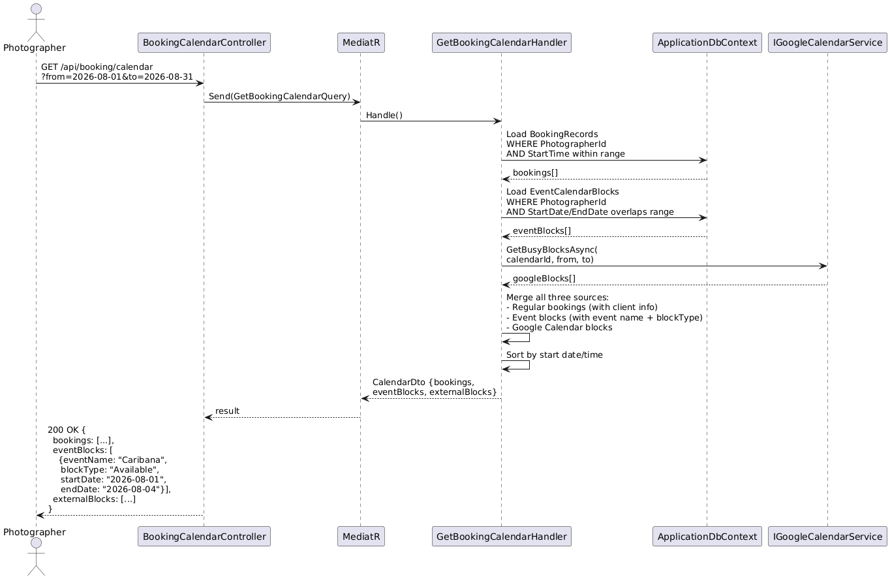

# F52 - Events Calendar & Booking Integration

## Overview

The Events Calendar provides a pre-populated calendar of Toronto Black cultural events, serving as both a community resource and a booking catalyst for photographers. The platform ships with seed data for at least 6 major events -- Toronto Caribbean Carnival (Caribana), Afrofest, Afro-Carib Fest, KUUMBA, Toronto Black Film Festival, and Black History Month -- each stored with full metadata: name, description, venue, neighborhood, category (Festival, Cultural, or Community), typical start and end months, website URL, and a recurrence pattern. Annual recurring events automatically generate instances for any queried year, so the calendar always shows upcoming occurrences even though only the template is stored.

The public-facing events API allows browsing events by date range with optional category and neighborhood filters. Results include only approved events (seeded events are auto-approved) and are ordered by start date. The recurrence engine generates dated instances on-the-fly when the query spans a year range, mapping `typicalStartMonth`/`typicalEndMonth` to concrete dates in the requested year.

The booking integration connects the events calendar to the photographer's existing booking system (F25). Photographers can sync any calendar event to their booking calendar, creating a calendar block with a configurable block type (Available, Blocked, or Tentative) that appears alongside their regular bookings. They can also create event-linked session types -- special photography packages tied to a specific event, with availability automatically scoped to the event's date range. This lets photographers offer targeted services like "Caribana Portrait Session" that are only bookable during the event dates.

**L2 Requirements:** EVT-24.1.1 (Seed Events), EVT-24.2.1 (List by Date Range), EVT-24.2.2 (Sync to Booking Calendar), EVT-24.2.3 (Event-Linked Session Types)

---

## Components

### Domain Layer

| Component | Type | Description |
|-----------|------|-------------|
| `CulturalEvent` | Entity | Core event entity. Fields: `Name` (required), `Description`, `Venue`, `Neighborhood`, `Category` (EventCategory enum), `TypicalStartMonth` (int, 1-12), `TypicalEndMonth` (int, 1-12), `StartDate` (DateTime?), `EndDate` (DateTime?), `WebsiteUrl`, `Recurrence` (EventRecurrence enum), `Status` (EventStatus enum), `IsSeeded` (bool), `SubmittedById` (Guid?, null for seeded). Extends `BaseEntity`, implements `ISoftDeletable`, `IAuditableEntity`. |
| `EventCategory` | Enum | `Festival`, `Cultural`, `Community`. |
| `EventRecurrence` | Enum | `None`, `Annual`, `Monthly`, `Weekly`. |
| `EventStatus` | Enum | `Pending`, `Approved`, `Rejected`. |
| `EventCalendarBlock` | Entity | Links an event to a photographer's booking calendar. Fields: `PhotographerId`, `CulturalEventId`, `BlockType` (CalendarBlockType enum), `StartDate`, `EndDate`, `Notes`. Implements `ITenantEntity`. |
| `CalendarBlockType` | Enum | `Available`, `Blocked`, `Tentative`. |
| `EventSyncedEvent` | Domain Event | Raised when a photographer syncs an event to their calendar. Used by booking availability engine to include/exclude the block. |

### Application Layer

| Component | Type | Description |
|-----------|------|-------------|
| `ListEventsQuery` | Query | Public. Returns events within a date range. Accepts `From` (DateTime), `To` (DateTime), optional `Category` (EventCategory?), optional `Neighborhood` (string?). Generates recurring event instances for the queried period. Returns only approved events, ordered by start date. |
| `GetEventDetailQuery` | Query | Public. Returns full metadata for a single event by ID. |
| `SyncEventToCalendarCommand` | Command | Authenticated. Creates an `EventCalendarBlock` linking the event to the photographer's booking calendar. Accepts `EventId`, `BlockType`, optional `Notes`. Computes `StartDate`/`EndDate` from the event's dates or typical months for the current/next occurrence. |
| `RemoveEventSyncCommand` | Command | Authenticated. Removes an `EventCalendarBlock` for the photographer. |
| `CreateEventLinkedSessionTypeCommand` | Command | Authenticated. Extends `CreateSessionTypeCommand` (F25) with an `EventId` field. Sets the session type's availability window to the event's date range. Validates that the event exists and is approved. |
| `GetEventLinkedSessionTypesQuery` | Query | Authenticated. Returns session types linked to a specific event. Filters `SessionType` where `EventId = @eventId` and `PhotographerId = currentUser`. |
| `GetBookingCalendarQuery` | Query (extended, F25) | Extended to include `EventCalendarBlock` entries alongside regular bookings and Google Calendar blocks. Each block includes the linked event name and block type. |
| `EventSummaryDto` | DTO | Listing result: `Id`, `Name`, `Description`, `Venue`, `Neighborhood`, `Category`, `StartDate`, `EndDate`, `WebsiteUrl`, `IsRecurringInstance` (bool), `Recurrence`. |
| `EventDetailDto` | DTO | Full detail: all fields from `EventSummaryDto` plus `TypicalStartMonth`, `TypicalEndMonth`, `Status`, `IsSeeded`, `SubmittedByName`. |
| `EventCalendarBlockDto` | DTO | Calendar block: `Id`, `EventId`, `EventName`, `BlockType`, `StartDate`, `EndDate`, `Notes`. |
| `IEventRecurrenceService` | Interface | Generates concrete event instances from recurrence templates. `GenerateInstances(CulturalEvent event, DateTime from, DateTime to)` returns `List<EventInstance>`. |

### Infrastructure Layer

| Component | Type | Description |
|-----------|------|-------------|
| `ListEventsQueryHandler` | Handler | Loads approved events, applies category/neighborhood filters. For recurring events, calls `IEventRecurrenceService` to generate instances within the date range. Merges one-time and generated instances, orders by start date, paginates. |
| `SyncEventToCalendarCommandHandler` | Handler | Validates event exists and is approved. Computes block dates from event dates (or next occurrence for annual events). Creates `EventCalendarBlock`. Raises `EventSyncedEvent`. |
| `CreateEventLinkedSessionTypeCommandHandler` | Handler | Validates event exists and is approved. Delegates to the existing `CreateSessionTypeCommandHandler` (F25) with additional `EventId` field and auto-computed availability windows matching the event dates. |
| `EventRecurrenceService` | Service | Implements `IEventRecurrenceService`. For `Annual` recurrence: maps `TypicalStartMonth`/`TypicalEndMonth` to the requested year, creates instances for each year in the query range. For `Monthly`/`Weekly`: generates instances at the specified interval within the range. |
| `EventSeedService` | Service | Runs on application startup. Seeds 6 required cultural events if they do not already exist. Each seeded event has `IsSeeded=true`, `Status=Approved`, `Recurrence=Annual`. |
| `CulturalEventConfiguration` | EF Config | Index on `(Status, StartDate)` for listing queries. Index on `(Category, Neighborhood)` for filtered searches. |
| `EventCalendarBlockConfiguration` | EF Config | Unique constraint on `(PhotographerId, CulturalEventId)` to prevent duplicate syncs. Index on `(PhotographerId, StartDate)` for calendar queries. |
| `SessionTypeConfiguration` | EF Config (extended, F25) | Adds nullable `EventId` column with foreign key to `CulturalEvent`. Index on `(PhotographerId, EventId)` for event-linked session type queries. |

### API Layer

| Component | Type | Description |
|-----------|------|-------------|
| `EventsController` | Controller | Public: `GET /api/events` (list with date range, category, neighborhood filters). `GET /api/events/{id}` (detail). Authenticated: `POST /api/events/{id}/sync` (sync to calendar with blockType). `DELETE /api/events/{id}/sync` (remove sync). |
| `SessionTypesController` | Controller (extended, F25) | Extended `POST /api/session-types` to accept optional `eventId`. Extended `GET /api/session-types` to accept optional `eventId` filter. |
| `BookingCalendarController` | Controller (extended, F25) | Extended `GET /api/booking/calendar` to include `EventCalendarBlock` entries. |

---

## Class Diagrams

### Domain Layer -- Cultural Event Entity & Enums

### Domain Layer -- Calendar Block & Session Type Link

### Application Layer -- Event Commands & Queries

### Application Layer -- Event DTOs

### Infrastructure Layer -- Event Services

### API Layer -- Events Controllers

---

## Sequence Diagrams

### List Events with Recurring Instance Generation

### Sync Event to Photographer Booking Calendar

### Create Event-Linked Session Type

### View Booking Calendar with Event Blocks

