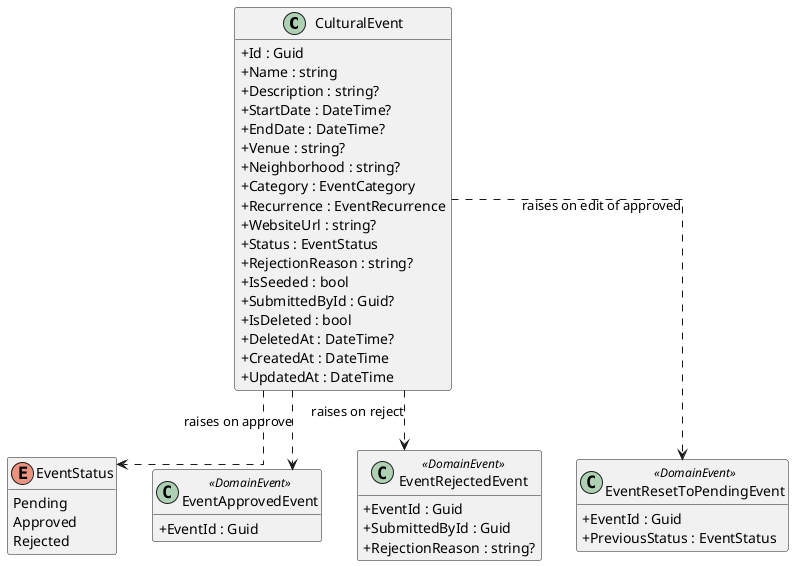
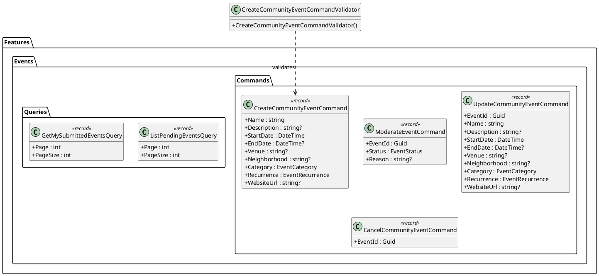
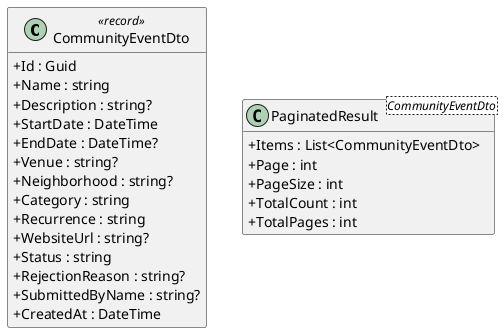
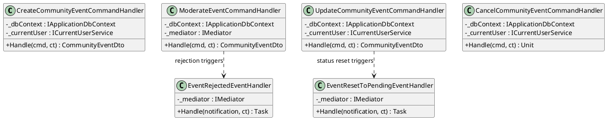
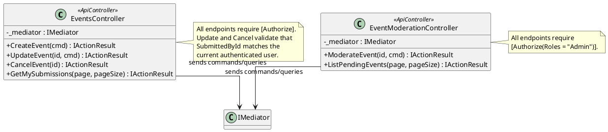
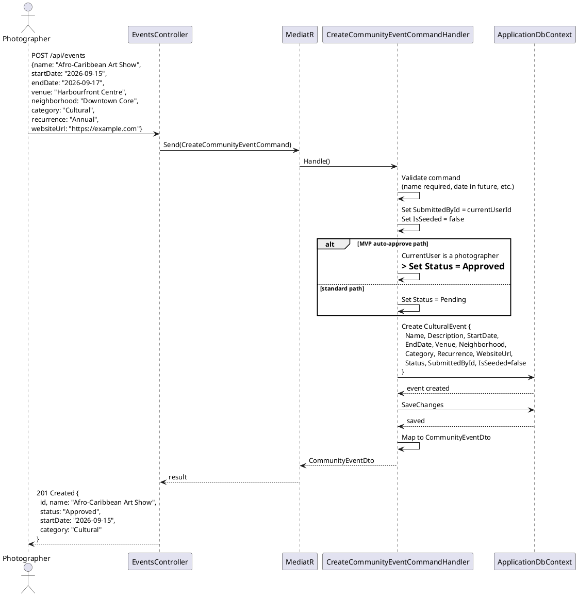
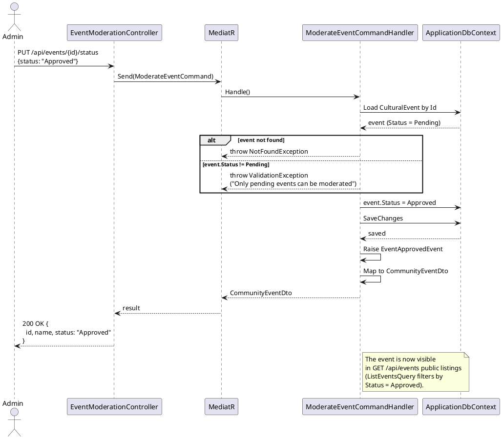
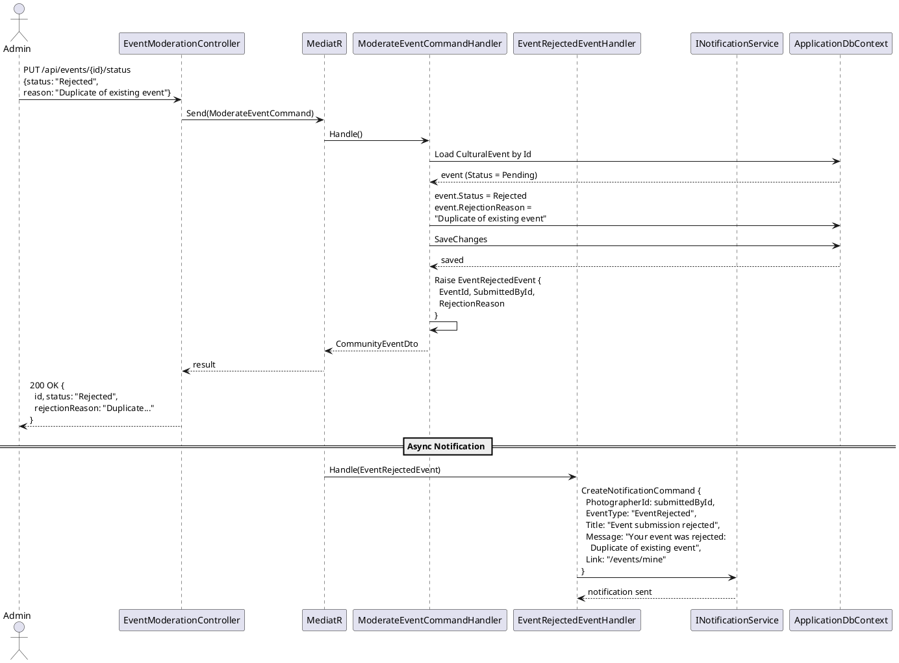
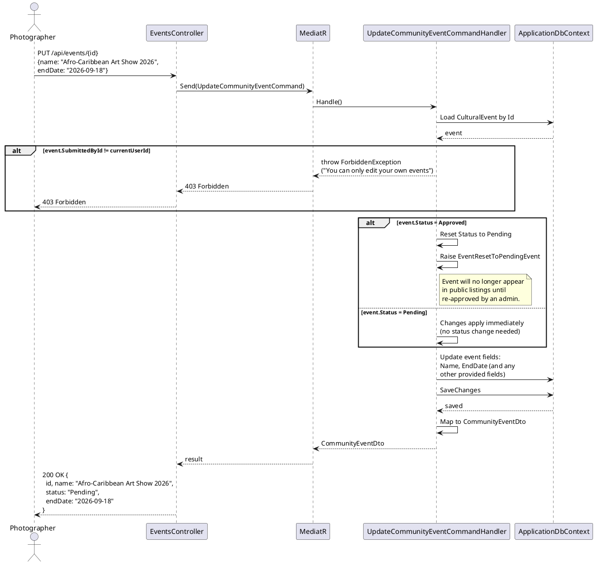
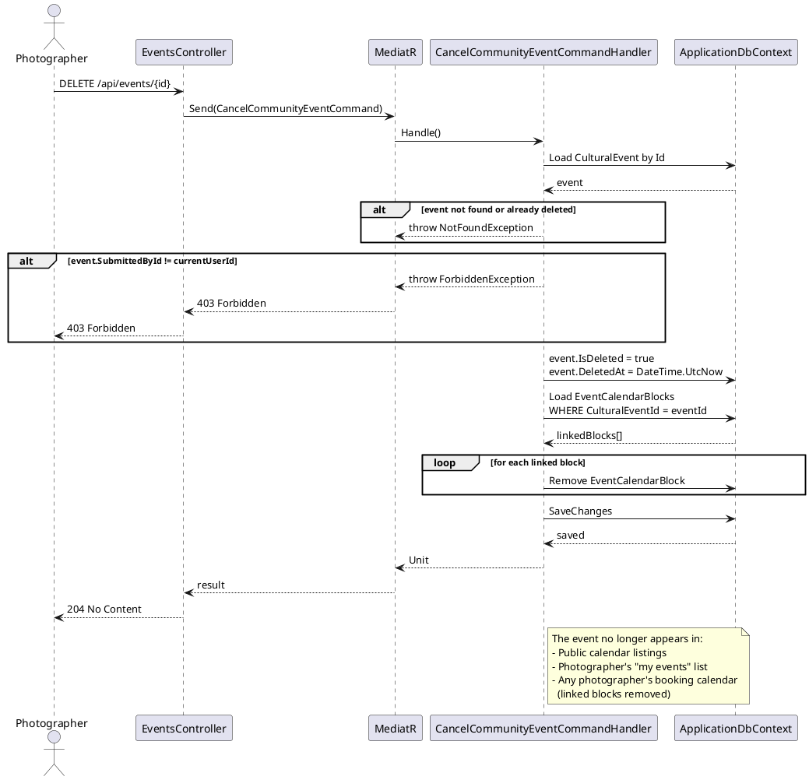

# F53 - Community Event Submissions

## Overview

Community Event Submissions extends the Events Calendar (F52) with a user-generated content workflow. Authenticated photographers can submit new community events to the calendar, providing event details including name, description, dates, venue, neighborhood, category, recurrence pattern, and website URL. Submitted events are created with a `Pending` status and enter a moderation pipeline before appearing in the public calendar. For MVP, a self-moderation shortcut auto-approves events submitted by the photographer who owns them, eliminating the moderation bottleneck during early platform adoption.

The moderation workflow provides administrators with the ability to approve or reject pending events. Approved events immediately become visible in the public calendar listings (F52's `ListEventsQuery` already filters by `Status=Approved`). Rejected events trigger a notification to the submitting photographer that includes the rejection reason. The moderation endpoint accepts a status change (Approved or Rejected) with an optional reason string, and the rejection reason is persisted on the event record for audit purposes.

Photographers can edit and cancel their own events. Editing a `Pending` event applies changes immediately since it has not yet been published. Editing an `Approved` event resets its status to `Pending`, requiring re-moderation before the updated version appears publicly -- this prevents unreviewed changes from going live. Cancellation is implemented as a soft-delete: the event's `IsDeleted` flag is set, and it no longer appears in any public listings. The soft-delete preserves the record for audit trails and allows potential future restoration.

**L2 Requirements:** EVT-24.1.2 (Create Community Event), EVT-24.3.1 (Moderate Events), EVT-24.3.2 (Edit & Cancel Own Events)

---

## Components

### Domain Layer

| Component | Type | Description |
|-----------|------|-------------|
| `CulturalEvent` | Entity (existing, F52) | Extended with `RejectionReason` (string?, set when admin rejects). All other fields defined in F52. `Status` transitions: `Pending -> Approved`, `Pending -> Rejected`, `Approved -> Pending` (on edit). |
| `EventStatus` | Enum (existing, F52) | `Pending`, `Approved`, `Rejected`. |
| `EventRecurrence` | Enum (existing, F52) | `None`, `Annual`, `Monthly`, `Weekly`. |
| `EventApprovedEvent` | Domain Event | Raised when an event transitions to `Approved`. Triggers inclusion in public calendar queries. |
| `EventRejectedEvent` | Domain Event | Raised when an event is rejected. Carries `SubmittedById` and `RejectionReason`. Triggers notification to the submitter. |
| `EventResetToPendingEvent` | Domain Event | Raised when an approved event is edited and its status resets to `Pending`. Removes it from public listings until re-approved. |

### Application Layer

| Component | Type | Description |
|-----------|------|-------------|
| `CreateCommunityEventCommand` | Command | Authenticated. Creates a new `CulturalEvent` with `Status=Pending`, `IsSeeded=false`, `SubmittedById=currentUser`. Accepts: `Name` (required), `Description`, `StartDate` (required), `EndDate`, `Venue`, `Neighborhood`, `Category`, `Recurrence`, `WebsiteUrl`. For MVP: if the submitting user is the photographer, auto-sets `Status=Approved`. |
| `ModerateEventCommand` | Command | Admin-only. Accepts `EventId`, `Status` (Approved or Rejected), optional `Reason`. Validates event is in `Pending` state. Sets the new status and persists the reason. Raises `EventApprovedEvent` or `EventRejectedEvent`. |
| `UpdateCommunityEventCommand` | Command | Authenticated. Updates an event the current user submitted. Validates `SubmittedById = currentUser` (403 otherwise). If the event was `Approved`, resets status to `Pending` and raises `EventResetToPendingEvent`. If `Pending`, applies changes directly. Accepts all mutable event fields. |
| `CancelCommunityEventCommand` | Command | Authenticated. Soft-deletes an event the current user submitted. Validates ownership (403 otherwise). Sets `IsDeleted=true`, `DeletedAt=now`. Also soft-deletes any `EventCalendarBlock` records linked to this event. |
| `ListPendingEventsQuery` | Query | Admin-only. Returns all events with `Status=Pending`, ordered by `CreatedAt` ascending (oldest first for fair review). Paginated. |
| `GetMySubmittedEventsQuery` | Query | Authenticated. Returns all events where `SubmittedById = currentUser`, including Pending, Approved, and Rejected (not soft-deleted). Allows the photographer to track their submissions. |
| `CreateCommunityEventCommandValidator` | Validator | Name required (max 200 chars). StartDate required and must be in the future. EndDate >= StartDate if provided. Category must be valid enum. Recurrence must be valid enum. WebsiteUrl must be valid URL format if provided. |
| `CommunityEventDto` | DTO | Submission result: `Id`, `Name`, `Description`, `StartDate`, `EndDate`, `Venue`, `Neighborhood`, `Category`, `Recurrence`, `WebsiteUrl`, `Status`, `RejectionReason`, `CreatedAt`. |
| `INotificationService` | Interface (existing, F40) | Used to notify the submitter when their event is rejected. Dispatches a `NotificationEvent` with category `Other` and a deep link to the event. |

### Infrastructure Layer

| Component | Type | Description |
|-----------|------|-------------|
| `CreateCommunityEventCommandHandler` | Handler | Creates the `CulturalEvent` entity. For MVP auto-approve: checks if the authenticated user is a photographer (role check) and auto-sets `Status=Approved`. Persists and returns the event. |
| `ModerateEventCommandHandler` | Handler | Loads the event, validates it is `Pending`. Updates `Status` and `RejectionReason`. On approval: raises `EventApprovedEvent`. On rejection: raises `EventRejectedEvent`, dispatches notification to submitter via `INotificationService`. |
| `UpdateCommunityEventCommandHandler` | Handler | Loads the event, validates ownership. If `Status=Approved`, changes to `Pending` and raises `EventResetToPendingEvent`. Updates all provided fields. Persists. |
| `CancelCommunityEventCommandHandler` | Handler | Loads the event, validates ownership. Sets `IsDeleted=true`. Also queries `EventCalendarBlock` where `CulturalEventId = eventId` and soft-deletes those blocks (so synced calendar entries are cleaned up). |
| `EventRejectedEventHandler` | Event Handler | Listens for `EventRejectedEvent`. Creates a notification for the submitting photographer via `CreateNotificationCommand` with message including the rejection reason. |
| `EventResetToPendingEventHandler` | Event Handler | Listens for `EventResetToPendingEvent`. Optionally notifies admin of a re-review needed (if admin notification preferences are configured). |
| `CulturalEventConfiguration` | EF Config (extended, F52) | Adds `RejectionReason` column (nullable, max 500 chars). Index on `(Status, CreatedAt)` for moderation queue. Index on `(SubmittedById, IsDeleted)` for "my submissions" query. |

### API Layer

| Component | Type | Description |
|-----------|------|-------------|
| `EventsController` | Controller (extended, F52) | New endpoints: `POST /api/events` (create community event, `[Authorize]`). `PUT /api/events/{id}` (update own event, `[Authorize]`). `DELETE /api/events/{id}` (cancel/soft-delete own event, `[Authorize]`). `GET /api/events/mine` (list own submissions, `[Authorize]`). |
| `EventModerationController` | Controller | Admin-only endpoints: `PUT /api/events/{id}/status` (approve/reject, `[Authorize(Roles = "Admin")]`). `GET /api/events/pending` (moderation queue, `[Authorize(Roles = "Admin")]`). |

---

## Class Diagrams

### Domain Layer -- Community Event Status Lifecycle

### Application Layer -- Submission & Moderation Commands

### Application Layer -- Submission DTOs

### Infrastructure Layer -- Event Handlers

### API Layer -- Events & Moderation Controllers

---

## Sequence Diagrams

### Submit a Community Event (MVP Auto-Approve)

### Admin Approves a Pending Event

### Admin Rejects a Pending Event

### Edit an Approved Event (Resets to Pending)

### Cancel (Soft-Delete) Own Event

